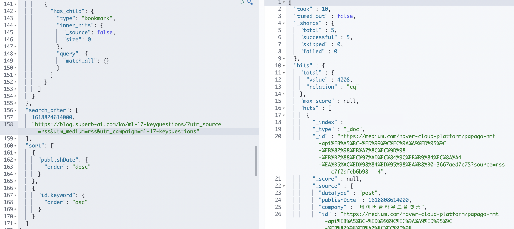
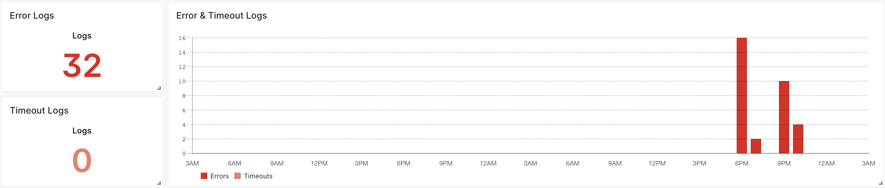

## 오류 발생 조건

오류는 첫 페이지 로딩 시에는 발생하지 않았고, 데이터를 추가로 불러올 때 발생하였습니다.
또한 500에러를 표시하고 있었기 때문에 ElasticSearch 에러, 마지막으로 서버 로직 에러로 범위를 좁힐 수 있었습니다.
지금까지 잘 작동하던 코드였기 때문에 ElasticSearch의 상태를 먼저 점검하기로 했습니다.
현재 ElasticSearch를 프리 티어로 사용 중이기 때문에 가끔 죽는 현상이 있었기 때문입니다.
(이는 한 개의 노드로 구성된 서버이기 때문에 JVM 메모리가 75%에 도달하는 경우 GC를 위해 잠시 노드가 다운되는 현상으로 확인하였습니다. 
즉 💰가 필요한 문제라 아직은 그냥 두고 보기로 했습니다.)

## ElasticSearch 체크

하지만 ElasticSearch의 서버는 잘 동작하고 있었고, 다음 페이지의 데이터도 문제 없이 내려주고 있었습니다.



그렇다면 문제는 역시 작성한 코드였던 겁니다. 😭

## 코드 체크

직접적으로 오류가 발생한 부분은 아래의 코드였습니다.

```js
const sort = JSON.parse(req.query.sort+ '');
```

그래서 req.query 객체를 찍어보았더니 아래와 같은 데이터를 표시했습니다.

```js
{
  sort: '[1618824614000,"https://blog.superb-ai.com/ko/ml-17-keyquestions/?utm_source=rss',
  utm_medium: 'rss',
  utm_campaign: 'ml-17-keyquestions"]'
}
```

sort의 값이 정상적인 값이 아니라 파싱에 오류가 발생한 것이었습니다.
정상적이라면 아래와 같아야 합니다.

```js
{
  sort: '[1618824614000,"https://blog.superb-ai.com/ko/ml-17-keyquestions/?utm_source=rss&utm_medium=rss&utm_campaign=ml-17-keyquestions"]'
}
```

위와 같이 URL이 붙어 나오지 않고 떨어진 이유는 next.js에서 제공하는 req.query는 말 그대로 URL의 파라미터를 자동으로 분류해 주기 때문에
sort에 담겨 보내지는 URL에 파라미터 구분자인 '&'가 존재한다면 이를 클라이언트에서 보낸 파라미터로 인식하고 친절하게도 잘라내 주었던 것입니다.

## 코드 수정

포스트의 주소는 블로그마다 만드는 기준이 다르기 때문에 저장 시 따로 처리할 수 없습니다. 그래서 sort 외에 잘리는 다른 부분을 합쳐주기로 했습니다.

```js
const queryObject = req.query;
const keys = Object.keys(queryObject);
const queryString = keys.reduce((acc, key) => {
  if(key === 'sort'){
    acc += queryObject[key];
  }else{
    acc += `&${key}=${queryObject[key]}`;
  }
  return acc;
}, '');
const sort = JSON.parse(queryString);
```

## 로그 확인

당황한 마음에 오류를 수정하느라 로그 확인을 뒤늦게 했습니다. 무려 32번의 람다 오류를 표시해 주고 있었습니다.



Alert 설정도 해두었지만 필터가 잘못 걸려있어 동작하지 않았습니다. 얼른 수정해 주었습니다. 😥

## 마치며

코드가 잘 동작하다가도 생각지 못한 예외 상황이 발생할 수 있으며, 코드를 100% 신뢰하기엔 제가 많이 부족함을 느꼈습니다.
더욱 공부를 하고 이러한 경험이 쌓이다 보면 저도 더욱 많은 예외를 고려한 코드를 작성할 수 있겠죠? 😅

사실 최근에 비슷한 경험을 한 트러블슈팅 사례가 있었습니다. 이 경우는 제가 캐치하지 못하고 사용자분이 이슈를 등록해 주셔서 수정할 수 있었습니다.
처음 받아보는 이슈 + 당황에 깃헙에 이슈로 등록해 주신 걸 인지하지 못하고 메일로 답변을 보냈답니다.
그런데 깃헙이 답장 받은 메일을 자동으로 이슈에 댓글로 달아주는 기능이 있어서 댓글로 등록해 주었습니다. 역시 대단하다는 생각을 했습니다. 해당 이슈는 아래 링크로 남겨두겠습니다.

<ExternalLink href="https://github.com/jthcast/techblogposts/issues/1">기술 블로그 모음 페이지 반복 현상 이슈</ExternalLink>

Techblogposts를 사용해 주시는 모든 분들, 메일 혹은 이슈로 개발에 참여해 주시는 분들, 저장소에 스타 혹은 포크를 해주시는 분들께 정말로 감사한 마음입니다.
덕분에 개발이 더욱 재미있어요. 감사합니다. 🥰
