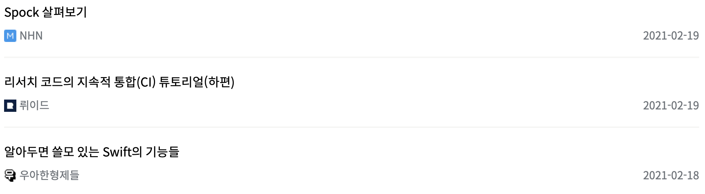

## 크로스 브라우징

같은 CSS, 같은 Javascript를 작성해도 브라우저마다 다르게 연산하는 경우가 있습니다. 연산이 다르면 당연히 결과도 달라지겠지요?

Chrome, Safari, Internet Explorer, Firefox, 그리고 네이버의 Whale 등 현재 많은 종류의 브라우저들이 서비스되고 있습니다.
웹 개발은 사용자의 여러 가지 브라우저에 대응하도록 테스트하며 개발하는 것이 중요합니다.
PC 브라우저뿐만이 아닌 Mobile 브라우저도 마찬가지로 신경 써야 합니다.


저 같은 경우 IE는 완전히 배제하기 위해 IE11 미만은 브라우저 업데이트 페이지를, IE11로 접속할 경우 Edge로 열도록 작성했습니다. 🤣

Chrome과 Edge는 호환되기 때문에, Chrome과 Safari 사이에서 겪은 크로스 브라우징 이슈를 공유합니다.

## height: 100vh

사용자의 화면에 맞게 모두 채울 때 주로 사용합니다. 하지만 아이폰의 사파리에는 하단 바가 존재합니다.
(최근 크롬의 그룹 기능에서도 하단 바가 추가되었죠.)
문제는 100vh가 화면만 계산하는 것이 아닌, 하단 바의 길이까지 계산한다는 점입니다.
따라서 화면에 꽉 맞게 채우려고 100vh를 쓰는 순간, 하단 바의 길이까지 계산되어 스크롤이 생긴다는 점이죠.

```CSS
body {
  height: 100vh; //before
}
```

<Video src="./videos/before_vh.mp4">
  하단바와 스크롤 제어가 정상적이지 않습니다.
</Video>

이를 수정하기 위해 100vh를 100%로 계산하게끔 수정하였습니다.

```CSS
html, body {
  height: 100%; //after
}
```

<Video src="./videos/after_percentage.mp4">좋습니다 🎉</Video>

## height: 100%

아니, 100vh가 문제가 있어서 100%로 바꾸었는데 100%도 문제가 있다고요? 하지만 안심하세요. 다른 경우입니다.

이번에는 li 태그에 height 값을 주었을 때, 사파리에서만 문제가 발생하였습니다.

```SCSS
ul {
  li {
    height: 100%;
  }
}
```


li의 height 속성을 삭제하니 정상 작동하였습니다. 굳이 필요 없는 속성을 습관적으로 추가했다가 문제를 만든 경우였습니다.
이래서 습관이 중요합니다 여러분 😓


## overflow-y: overlay

```SCSS
{
  display: flex;
  flex-direction: column;
  flex: 1 auto;
  overflow-x: hidden;
  overflow-y: overlay;
  height: 100%;
  width: 100%;
}
```

최상위 화면을 위와 같은 형태로 감싸주어 사용하고 있었습니다. 해당 부분에서 overflow-y: overlay를 적용함으로써
스크롤바가 자리를 차지하지 않고 위에 그려주도록 설정할 수 있었습니다.


사파리에서는 의도한대로 동작하지 않습니다. 이유는 모르겠습니다. 해결법도 모르겠습니다. 해결법을 아시는 분은 메일 부탁드립니다. 🙏

## 폰트

크롬을 기준으로 테스트 하며 화면을 작성하였는데, 사파리에서는 폰트의 표시가 미묘하게 달랐습니다.


이는 브라우저가 폰트를 표현하는 방식이 다르기 때문입니다. 이러한 문제는 폰트마다 그 범위가 다른데, 제가 선택한 폰트가 유독
심하게 느껴진 반면, Noto Sans를 적용한 페이지에서는 아주 미세하게 느껴질 정도였습니다.

이 문제를 해결할 수 없어서 Apple 기기에서는 다른 글씨체를 표시하도록 설정하였습니다.

```CSS
* {
  font-family: -apple-system, 'IBMPlexSansKR-Light', 'Courier New', monospace;
}
```

페이지의 디자인에서 폰트가 주는 영향이 매우 크기 때문에 여러분들은 반드시 개발 초기에 확인하시기 바랍니다.

## Date 객체

자정을 기준으로 '~일 전'을 표시하는 기능이 사파리에서는 정상적으로 동작하지 않았습니다.




```JS
new Date('2021-1-1');
//Chrome: Fri Jan 01 2021 09:00:00 GMT+0900 (대한민국 표준시)
//Safari: Invalid Date

new Date('2021-01-01');
//Chrome: Fri Jan 01 2021 09:00:00 GMT+0900 (대한민국 표준시)
//Safari: Fri Jan 01 2021 09:00:00 GMT+0900 (KST)
```

이는 크롬과 사파리가 Date 객체를 처리하는 과정이 다르기 때문입니다.
Date 객체를 생성할 때, 한자리 날짜인 경우 앞에 0처리를 해주어야 사파리에서 정상 작동합니다.

## 사파리 환경을 테스트하고 싶은데 Mac이 없어요

사파리는 2012년 이후로 Windows 환경을 지원하지 않고 있습니다. 따라서 사파리를 테스트하려면 Mac과 아이폰이 필요합니다.

하지만 이런 장비가 없는 경우에도 제한되지만 테스트를 할 방법이 있습니다.<ExternalLink href="https://appetize.io">Appetize.io</ExternalLink>
에서 아이폰 에뮬레이팅을 웹 환경으로 지원합니다. 무료로 사용하신다면 60초 동안 사용하실 수 있습니다.
하지만, 개발자 도구를 사용할 수 없기 때문에 감으로 문제를 해결하셔야 합니다.
정말 급하시다면 사용해보세요. 🙄

저는 결국 맥북을 주문했지만, 배송 기간이 2주가 넘게 걸려 위의 방법으로 해결했습니다.

## 마치며

화면을 개발하신다면 위와 같은 크로스 브라우징 이슈를 확인하고 해결하기 위해 여러 가지 브라우저에서 테스트할 필요가 있습니다.
개발자 구인공고에도 '크로스 브라우징 이슈를 해결한 경험이 있으신 분'과 같은 부분이 적혀 있을 정도로 중요한 부분이라고 생각합니다.

사파리 환경 또한 테스트 대상이기 때문에 어쩔 수 없이 아이폰과 맥북을 구입하였는데요,
이러한 애플의 폐쇄성이 정말 마음에 들지 않지만 어쩔 수 없네요.
개발자분들이 맥을 많이 사용하는 이유에 이러한 이유도 있지 않을까 싶습니다.

모든 브라우저가 동일하게 동작하는 그날이 왔으면 좋겠네요. 😉
