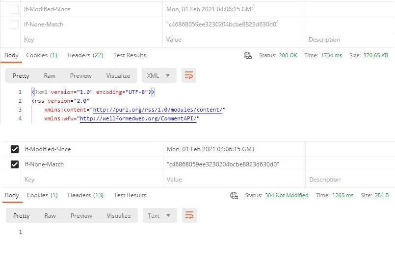

## 요구 사항

현재 <ExternalLink href="https://techblogposts.com">Techblogposts</ExternalLink>는
40여 개의 각 기술 블로그들에서 제공하는 RSS를 5분마다 크롤링 하여 데이터를 DynamoDB에 저장하고 있습니다.

저장하기 전 해당 데이터가 DB에 존재하는지 검사를 진행하고 저장합니다. 이 과정에서 DB의 읽기 용량 유닛을 사용합니다.
또한 사용자가 데이터를 요청할 때도 마찬가지로 읽기 용량 유닛을 사용합니다.
이 읽기 용량 유닛이 25를 넘는 순간 과금되기 때문에 최대한 많은 사용자를 프리 티어로 커버하기 위해서는
크롤링 과정에서 발생하는 읽기 용량 유닛을 최대한 적게 사용하도록 하는 로직 구성이 필요했습니다.

## 개선 전

개선 전은 아래와 같은 로직으로 데이터를 저장했습니다.

1. RSS를 파싱 합니다.
2. DB에 저장된 같은 기업 블로그의 모든 포스트를 불러옵니다.
3. 파싱 한 데이터와 포스트 데이터를 하나씩 비교합니다.
4. 등록되지 않은 포스트를 등록합니다.

이 과정 중 2번에서 복합키로 데이터를 조회하는 것이 아닌 **모든 데이터를 조회 후 Filter로 해당 기업의 포스트를 거르는 방식**으로
데이터를 불러오기 때문에 매우 큰 읽기 용량 유닛을 사용하고 있었습니다.

## 개선 방법

따라서 이를 개선하기 위해서는 두 가지 방법이 떠올랐습니다.

1. 수정된 블로그의 데이터만 불러와 비교하는 방법.
2. Filter를 하지 않고 복합키를 사용하여 데이터를 하나씩 조회하며 비교하는 방법.

1번 방법은 2번을 진행하더라도, 적용한다면 성능이 개선되는 부분이기 때문에 우선 1번을 진행하기로 했습니다.

## HTTP 조건부 요청

해당 블로그의 RSS가 수정되었는지 확인하는 방법 중 가장 효율이 좋은 방법은 **HTTP 조건부 요청** 방법입니다.

리소스를 HTTP 요청할 때 응답 헤더에서 `last-modified` 값과 `etag` 값을 확인할 수 있습니다.
`last-modified` 값은 마지막 수정일이며 `etag`는 리소스가 가진 고유한 지문 같은 값입니다. 리소스의 내용이 바뀐다면 `etag` 또한 바뀝니다.
이를 활용하여 리소스가 수정되었는지 확인할 수 있습니다.

HTTP 요청을 할 때 조건부 헤더를 포함하여 요청을 보내면 **수정되었을 시**만 데이터를 전송받을 수 있습니다.

> **조건부 헤더**
>
> **If-Modified-Since** : 원격지의 리소스의 Last-Modified 날짜가 이 헤더 내에 주어진 것보다 좀 더 최근인 경우 성공입니다.
>
> **If-None-Match** : 원격지 리소스의 ETag가 이 헤더에 나열된 것들과 일치하는 것이 없다면 성공입니다. 기본적으로, etag에 'W/'가 접두사로 붙지 않았다면, 강한 검사가 실행될 것입니다.
>
> <ExternalLink href="https://developer.mozilla.org/ko/docs/Web/HTTP/Conditional_requests">
>   HTTP 조건부 요청
> </ExternalLink>

조건부 헤더를 활용하여 잘 응답하는지 Postman으로 시도해 보겠습니다.

| 헤더 여부 | 상태 | 통신 시간 | 데이터 용량 |
| :-------: | :--: | :-------: | :---------: |
|   일반    | 200  |  1734ms   |  370.65kb   |
|  조건부   | 304  |  1265ms   |    784b     |

조건부 요청을 사용하지 않았을 시는 무조건 RSS 파일을 응답합니다.
하지만 조건부 요청을 사용하였을 시, 수정되지 않았다면 `304 Not Modified` 상태를 응답합니다.
이 경우 `Body`에 값을 담아 보내지 않기 때문에 통신 시간과 데이터 또한 아낄 수 있습니다.
서버와 클라이언트 모두에게 도움이 되는 방법이네요. 😎

하지만 이 방법은 사용할 수 없었습니다.

모든 서버가 조건부 헤더에 필요한 값을 제공하지는 않았기 때문이죠.

## 복합키로 데이터 조회

서로에게 좋은 방법인데 어째서 지원하지 않는 것인지 원망을 하고 다음 방법을 사용하기로 합니다.
헤더를 통해 수정되었음을 확인할 수 없다면, 데이터를 비교하는 과정에서 수정 여부를 확인하는 방법밖에 없습니다.

기존에는 DB를 여러 번 거치기 싫어서 한 번에 가져와 비교했지만 이런 방법은 RDB에서만 유효합니다.
DynamoDB는 특정한 조건의 데이터를 확인하는 방법이 Filter밖에 없는데, 이는 위에서 설명한것과 같이 모든 데이터를 조회하고
이 중 조건에 맞는 데이터를 걸러내는 방식이기 때문에 적합하지 않습니다.

따라서, RSS를 우선 파싱 한 후 각 아이템의 URL이 DB에 존재하는지를 한 번씩 조회하며 확인할 수밖에 없었습니다.
존재하지 않는다면 DB에 저장을, 존재한다면 이전 데이터 또한 DB에 존재할 것으로 가정하고 `break` 해줌으로써 추가적인 DB 요청을 줄였습니다.

이 방법은 사실 과거의 방법과 비교한다면 이전 데이터에서 제목과 게시 시간이 변경된 경우 업데이트를 할 수 없다는 단점과
새로운 블로그를 등록한다면 해당 블로그의 포스트를 등록 시
포스트 개수만큼 조회하여 그때의 읽기 용량 단위가 더 커질 수 있다는 단점이 있었습니다.
하지만 게시물의 데이터가 바뀌는 빈도가 적다는 점, 블로그 등록보다 주기적으로 크롤링 하는 경우가 더 많다는 점에서
위의 단점들보다 읽기 용량의 절약이 더 중요했기 때문에 선택했습니다.

## 개선 후

| 개선 여부 | 읽기 용량 단위 | 읽기 사용량 |
| :-------: | :------------: | :---------: |
|    전     |      12.5      |    5.52     |
|    후     |      0.5       |    0.35     |

개선 후 **읽기 사용량이 약 15.7배 감소**했습니다. 만약 블로그가 늘어나는 경우 이 차이는 더 심해졌을 것입니다.
과거에는 이러한 부담 때문에 적극적으로 글을 작성하지 않는 기업의 블로그는 제외하였으나,
개선 후에는 그 기준을 더 완화하여 많은 블로그들을 추가로 등록할 수 있었습니다. 🎉

이번 개선 과정을 통해 HTTP 조건부 요청과 헤더, 그리고 DynamoDB에 대해 좀 더 이해할 수 있었습니다.
앞으로는 많은 곳에서 응답 헤더에 `last-modified` 값과 `etag` 값을 제공해 주었으면 좋겠다는 생각과 함께 글을 마치겠습니다. 😂
