## 사파리 15의 주된 변경점

이번 WWDC2021이 공개되고 실망하시는 분들도 많은 것으로 알고 있습니다.
하지만, 웹 개발자인 제 입장에서는 사파리의 대대적인 업그레이드라는 큰 이슈가 존재하는 행사였습니다.

<ExternalLink href="https://developer.apple.com/videos/play/wwdc2021/10029/">
  Design for Safari 15
</ExternalLink>
에서 소개된 주된 변경점은 아래와 같습니다.
 
 

- theme-color 속성을 브라우저도 반영
- url 창의 위치 변경
- 끌어당겨 새로 고침 기능
- Visual Intelligence 기능
- aspect-ratio 등 지원하지 않던 CSS 속성 지원
- 폼 구성요소 UI 업데이트

저도 IOS 15 베타 버전을 설치하여 테스트를 진행해 보았는데요, 바뀐 부분을 하나씩 자세히 알아보도록 하겠습니다.

## theme-color

`theme-color` 속성은 PWA를 만들기 위해 반드시 있어야 하는 menifesto 파일을 설정할 때 주로 다루어 왔습니다.
PWA로 앱을 설치하면 해당 속성에 따라 상태 표시줄의 색상이 바뀌었었는데요,
사파리 15부터는 해당 기능이 브라우저에도 반영된다고 합니다.

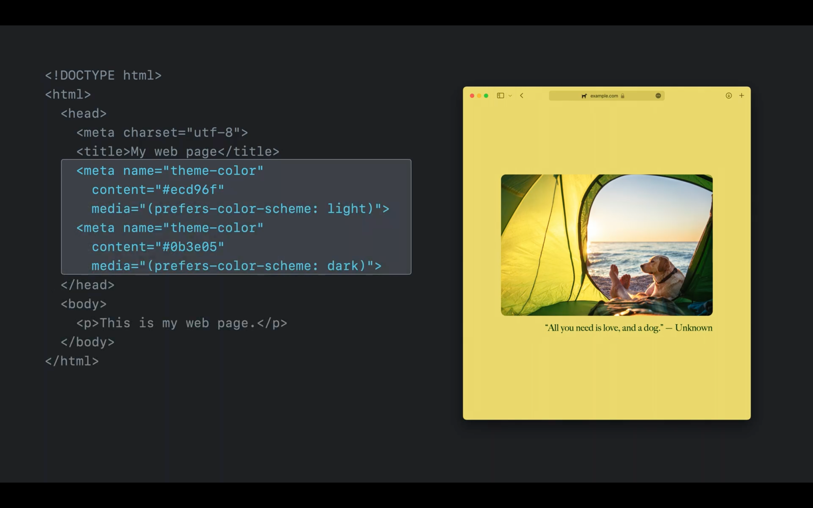

기존처럼 menifesto 파일을 작성해도 동작하지만, `meta` 태그를 사용해도 동작합니다.
특히 자바스크립트로 제어하길 원한다면 이 방식을 추천하고 있습니다.
예를 들어, 영화관 모드 등을 사용할 땐 강조되었던 색상을 검은색 등 어두운색으로 바꾸어준다면 사용자 경험에 훨씬 좋겠죠.
이 기능을 탑재함으로써 사용자는 브라우저가 아닌 페이지에 대해 몰입도를 높여줄 수 있습니다.

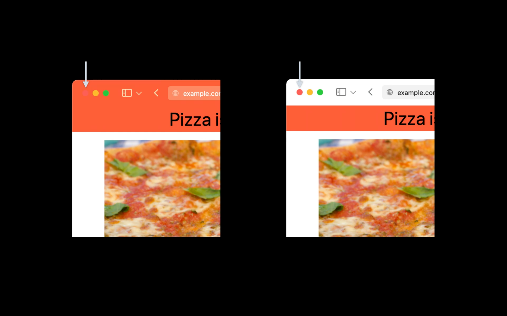

위와 같이 접근성에 위배되는 색상이라면 사파리는 자동으로 이를 감지하여 흰색으로 적용한다고 합니다.
더 나은 사용자 경험을 위해 개발자와 디자이너 간의 소통이 더욱 중요해지겠네요. 😁

## url 창의 위치 변경

사파리 15 모바일은 브라우저의 상단에 위치했던 url 창이 하단으로 이동하였습니다.

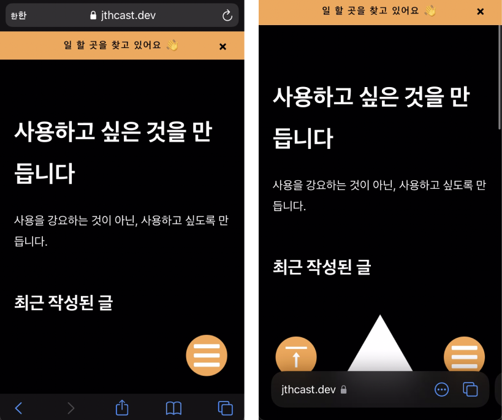

url 창의 위치가 하단으로 변경됨에 따라 기존에 하단에 배치되었던 버튼들이 가려지는 현상을 보실 수 있습니다.
애플은 이런 상황을 방지하기 위해 `env 변수`를 사용 할 것을 권하고 있습니다.

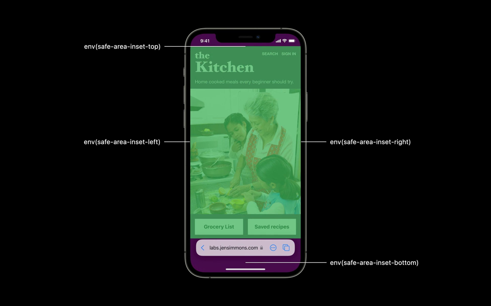

`env 변수`를 통해 브라우저가 간섭하는 부분의 값을 제공받을 수 있고,
이를 `margin` 또는 `padding`에 적용시킴으로써 간섭을 방지할 수 있습니다.
`env 변수`에 제공되는 값은 브라우저의 환경과 스크롤의 위치에 따라 자동으로 업데이트되니 하드코딩할 필요가 없습니다.

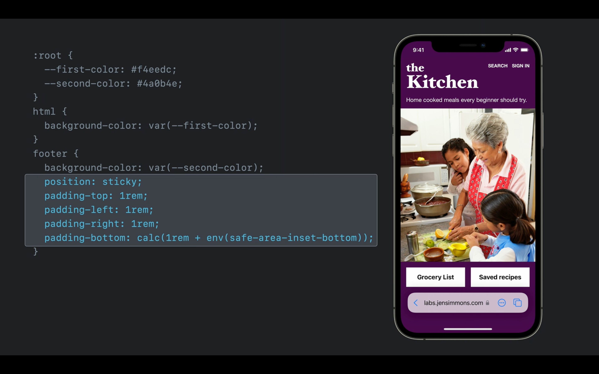

또한 휴대폰을 가로모드로 사용 시 노치에 의한 간섭도 이를 활용함으로써 극복할 수 있습니다.
개발자들은 일반적으로 `viewport`의 설정을 `width=device-width`로 설정합니다.

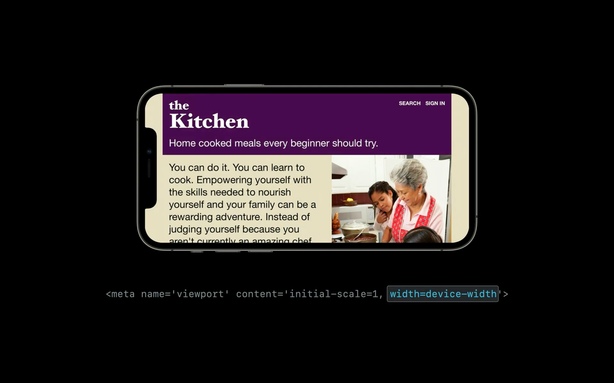

그러나 `viewport-fit`을 사용한다면 더욱 넓은 화면을 간섭 걱정 없이 제공할 수 있습니다.

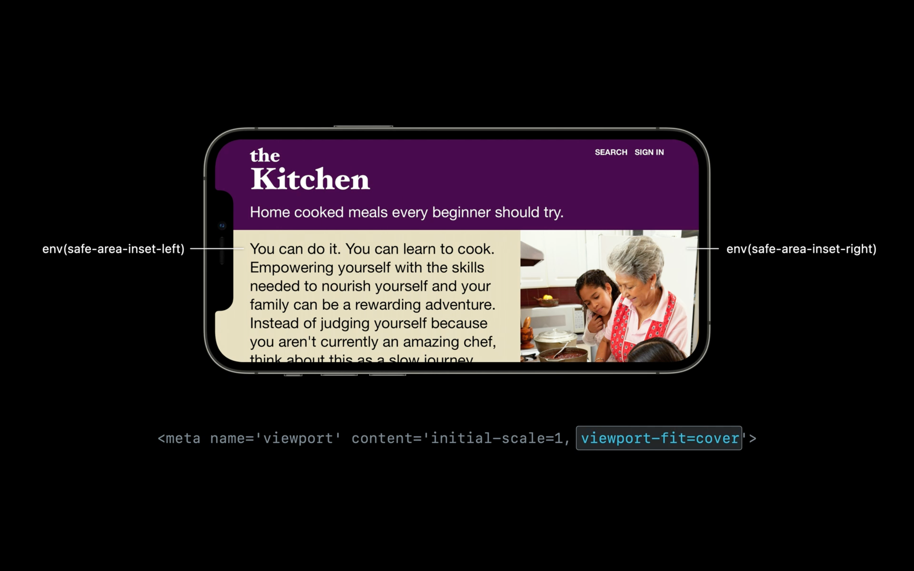

사용자에게 만족스러운 경험을 주기 위해서,
그리고 개발자에게 하드코딩이 아닌 개발을 위해서 `env 변수`와 `viewport`에 대해 알아야겠네요.

하지만 아직까지는 개선할 점이 보입니다.
모달을 띄울 때 url 창이 나왔다 사라졌다 하는 부분이 확인되었습니다.
제가 이전에 작업한 코드가 잘못된 것인지 사파리 버그인지는 모르겠지만, 이대로 출시된다면 조치가 필요해 보입니다.

<figure>
  <video
    preload="auto"
    muted
    loop
    playsInline
    autoPlay
    src="./videos/modal.mp4"
  />
</figure>

## 끌어당겨 새로 고침

크롬에서는 제공되었지만, 기존 사파리에서는 끌어당겨 새로 고침을 하는 기능이 제공되지 않았습니다.
이를 위해 개발자들은 따로 기능을 구현하거나 라이브러리를 사용했습니다.
그러나 15버전부터는 사파리도 이를 지원합니다.

<figure>
  <video
    preload="auto"
    muted
    loop
    playsInline
    autoPlay
    src="./videos/pull-to-refresh.mp4"
  />
</figure>

다만 직접 사용해본 결과 안드로이드의 방식에 비해 threshold의 수치나 부드러움이 부족해 보입니다.
아직은 베타버전이니 개선되어 출시되겠죠? 😅

또한, 안드로이드와 IOS의 표시 방식도 다르기 때문에 커스텀에 대한 수요는 앞으로도 있을 것이라 생각됩니다.
아래의 링크를 통해 커스텀 pull to refresh를 개발하는 법을 참고해 보세요.

<ExternalLink href="https://developers.google.com/web/updates/2017/11/overscroll-behavior/">
  Take control of your scroll: customizing pull-to-refresh and overflow effects
</ExternalLink>

## Visual Intelligence

휴대폰으로 사진을 찍으면 해당 사진 속의 문자를 분석하는 기능을 알고 계실 텐데요,
사파리 15에서는 브라우저에서 해당 기능을 지원합니다.
인식된 문자는 html 태그에 추가되어 다양한 기능을 사용할 수 있습니다.

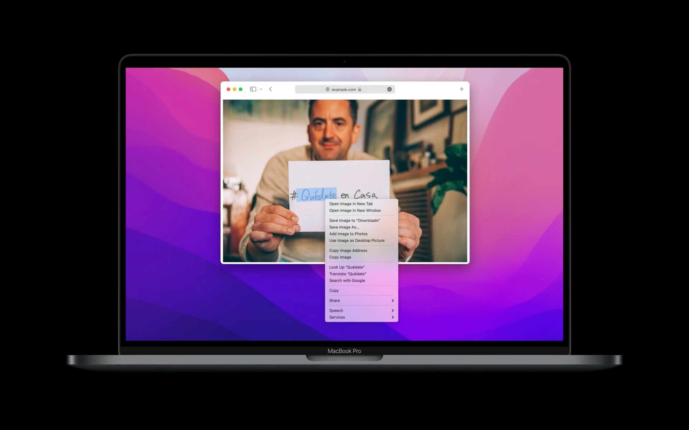

이 기능은 javascript에 영향을 받는 것이 아닌 z 축 레이어의 순서에 영향을 받습니다.
따라서, 레이어를 가장 위로 관리해야 해당 기능을 사용할 수 있습니다.
해당 기능을 제대로 사용하기 위해서는 `z-index`에 대한 관리가 잘 되어야 할 것으로 보이네요.

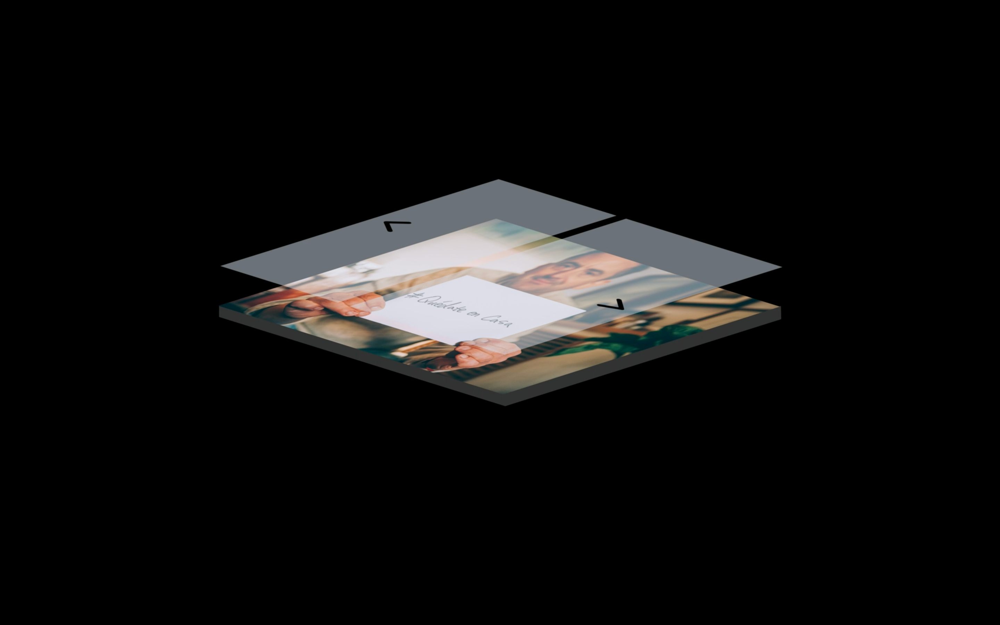

또한, 이 기능으로 웹 접근성을 대체하려는 시도는 좋지 않습니다.
위에서의 사례와 마찬가지로 동작하지 않는 경우가 충분히 존재하며,
모든 브라우저에서 해당 기능을 지원하는 것이 아니기 때문입니다.
따라서 애플은 기존의 `alt`와 같은 속성을 사용하여 웹 접근성을 고려할 것을 추천하고 있습니다.

## aspect-ratio 등 다양한 CSS 속성 지원

사파리 14버전까지 지원하지 않던 `aspect-ratio` css 속성을 이제 지원합니다.
이 속성은 적용된 요소의 크기를 일정 비율로 유지하는 기능을 합니다.
예를 들어, 인스타그램의 사진은 클릭하기 전에는 1:1의 정방형 비율을 가지도록 구현되어 있습니다.
인스타그램을 클론 한 Klaystagram 프로젝트를 할 때 이를 구현하기 위해 처음엔 `aspect-ratio`를 사용했었는데요,
해당 기능이 사파리에서 동작하지 않아 padding을 사용한 방법으로 바꾸었던 기억이 있네요. 😭

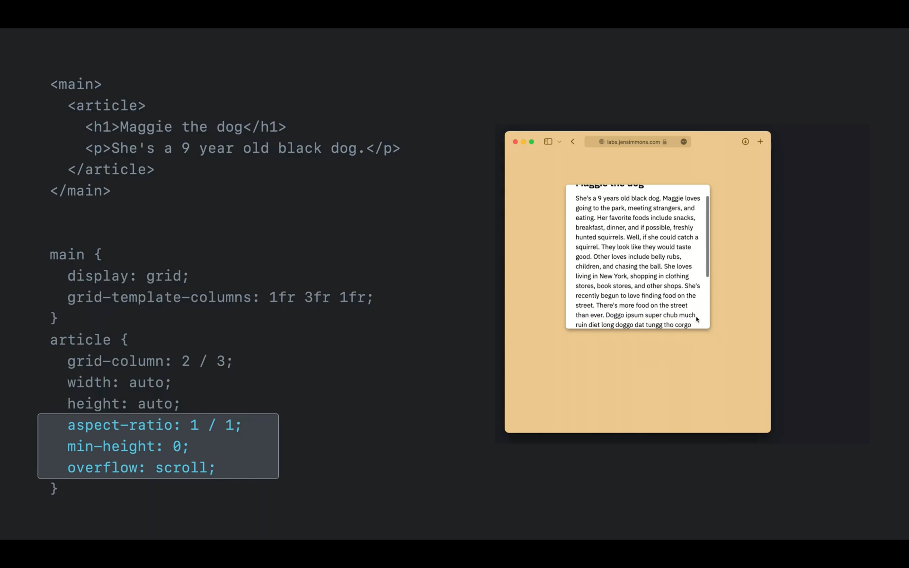

이 속성을 활용하면 다양한 비율을 쉽게 구현할 수 있습니다.

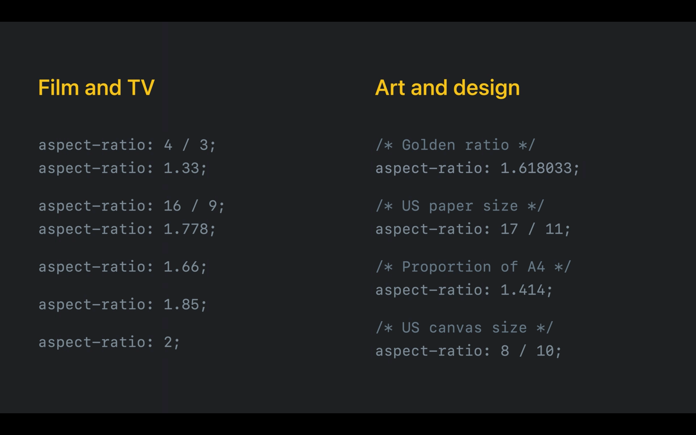

이처럼 이전에는 지원하지 않아 크로스 브라우징을 위해 사용하지 못했던 CSS 속성이 15버전에서는 많이 추가되었습니다.
이번 영상에서 애플은 `aspect-ratio`와 `gap`을 중점으로 소개했는데요,
`gap`의 경우 `grid` 레이아웃에서만 지원하던 것을 이제는 `flex` 레이아웃도 지원한다고 합니다.
이제 `last-child`와 같은 순서 선택자들을 활용하여 `margin`을 설정하던 부분이 훨씬 간결해질 것으로 예상됩니다.

이 밖에도 많은 기능이 추가되었으니 확인해보시기 바랍니다.

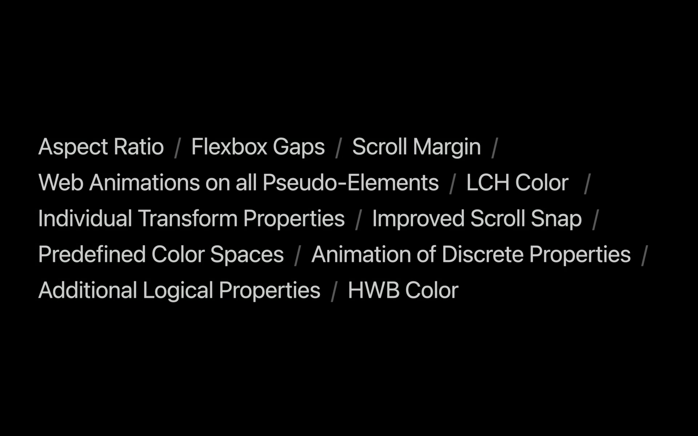

## 폼 구성요소 UI 업데이트

`Select box`와 같은 폼 구성요소들이 업데이트되었습니다.
특히, 다크 모드를 지원하여 자동으로 색상도 변환되도록 바뀌었습니다.
이전에는 이를 위해 `transparent` 혹은 특정 색상으로 css를 다시 작성하거나,
아예 UI kit 라이브러리를 사용 또는 제작하는 경우가 많았습니다.

이번에 사파리에서 이러한 기능이 업데이트되면서 귀찮았던 작업이 많이 줄어들 것 같습니다.
물론, 다른 브라우저에서도 동일한 경험을 주기 위해서 추가 작업이 앞으로도 많이 사용되겠지만요.

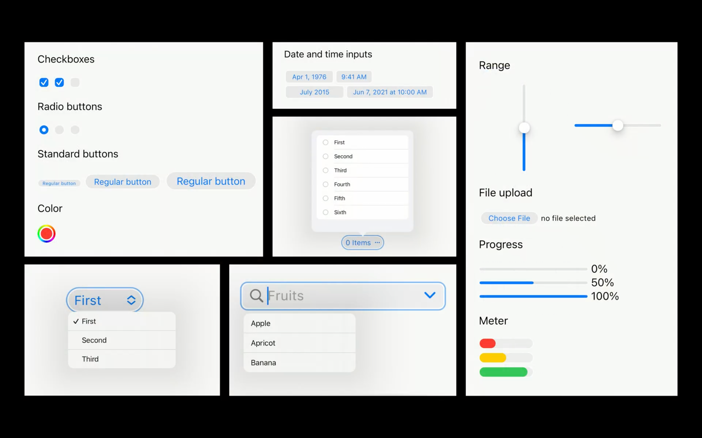
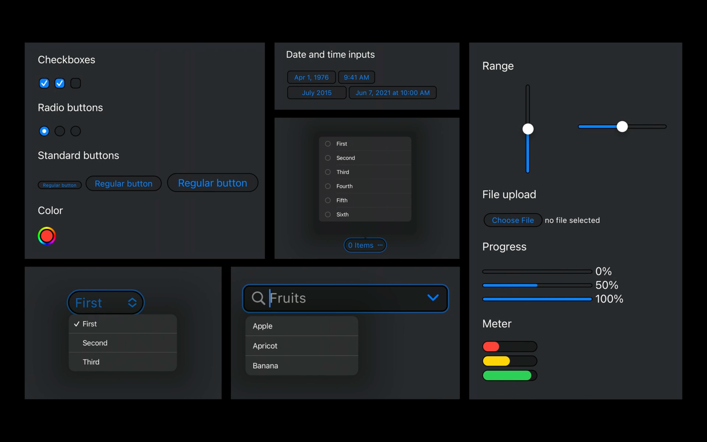
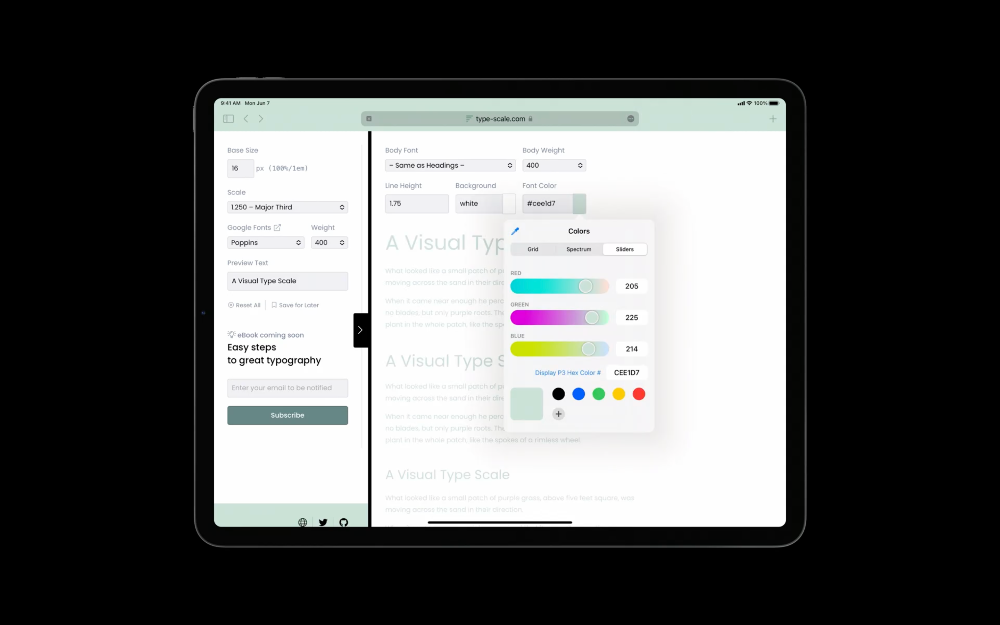

## 마치며

사파리 15에서는 굉장히 큰 UI&UX 변화가 있을 예정입니다.
다양한 기능이 업데이트되는 만큼, 정식 출시된 후 수정한다면 당연히 늦으므로 미리미리 공부하는 자세가 필요하다고 생각합니다.
프론트엔드 개발자로서 크로스 브라우징에 대한 고려는 빼놓을 수 없습니다.
다양한 브라우저가 개발되고 브라우저 생태계가 점점 모바일에 최적화 되도록 바뀌는 것 같다고 느껴집니다.
이러한 트렌드를 읽고 따라가기 위해서 WWDC와 같은 개발자 컨퍼런스는 당연히 주목해야 하며 좋은 행사라는 생각이 듭니다. 감사합니다.
