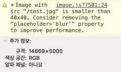
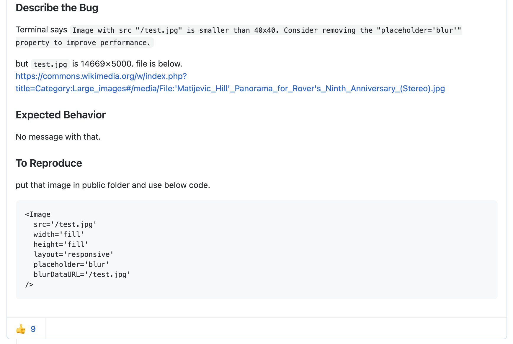
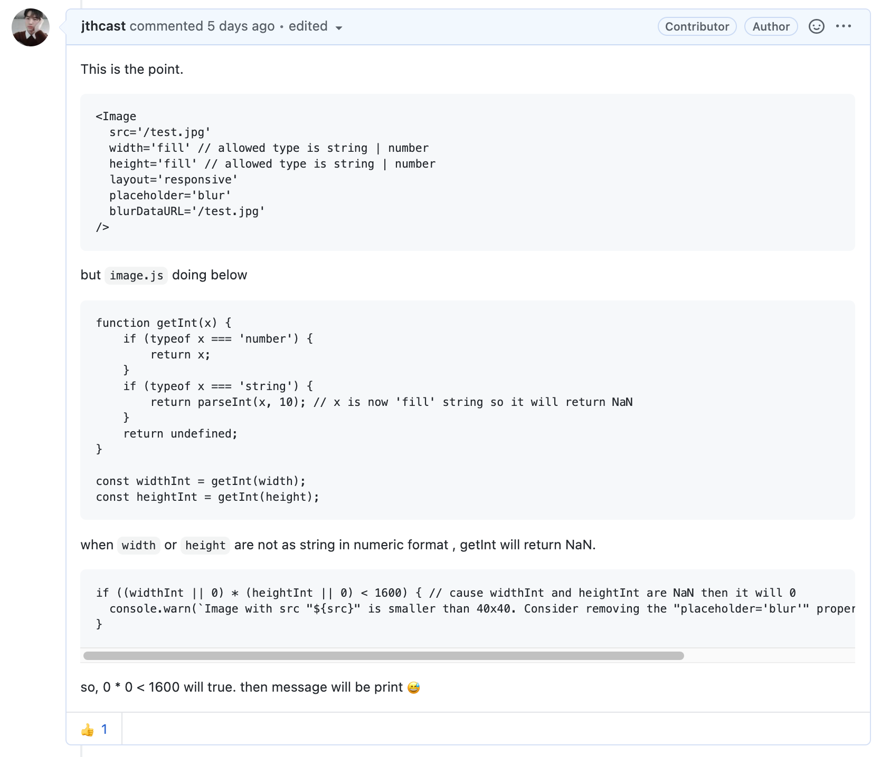
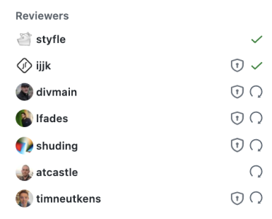
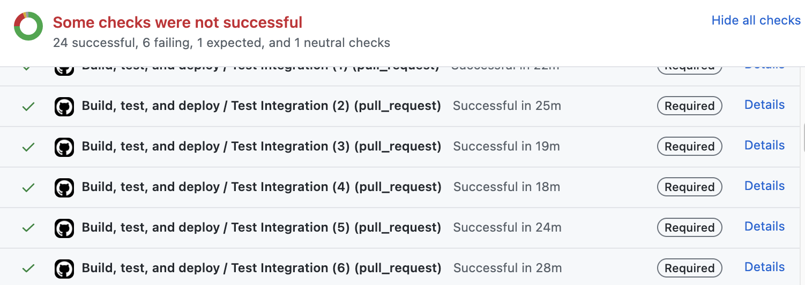
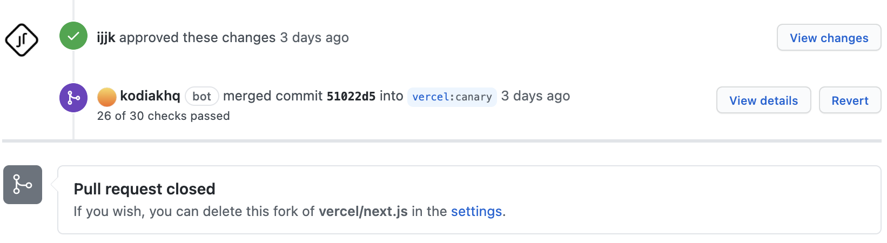
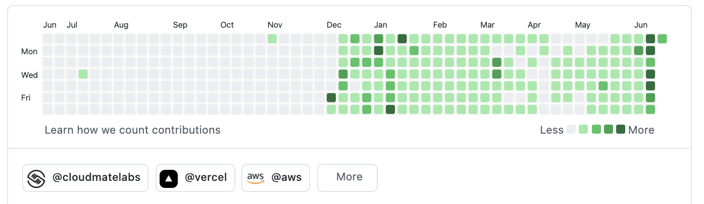

## Next.js 11 Conf

Next.js가 이번에 11 버전이 릴리즈 되며 관련 소개 행사를 진행하였습니다.
해당 컨퍼런스의 주요 내용은 아래와 같습니다.

- DX 개선

  - 빨라진 개발 환경
  - 스태틱 이미지 자동화
  - Create React App 마이그래이션

- UX 개선

  - 이미지 블러 지원
  - 스크립트 최적화
  - ESLint 준수

- Next Live 기능(Figma처럼 코드를 넷상에서 협업하며 작성할 수 있습니다.)

## 이미지 블러 기능에서 찾는 버그

이미지 블러 기능은 Medium에서 블로그를 보시는 분들은 익숙하실 기능입니다.

<ExternalLink href="https://jthcast.dev/posts/gatsby-versus-nextjs/">
  Gatsby VS Next.js
</ExternalLink>
에서 말씀드린 Gatsby 에서만 지원하던 기능이 이번에 Next.js에도 도입이 된 것입니다.
해당 기능이 도입되었다는 소식에 바로 적용시켜 테스트해 보았는데 엉뚱한 경고 메시지를
콘솔에 표시해 주었습니다.



## 이슈 등록

여러 테스트 후 이것은 버그임을 확신한 뒤 바로 이슈를 작성하였습니다.



이슈를 등록 후 짧은 시간 안에 👍 가 여러 개 박히고,
코멘트 또한 달리는 것을 보고 좀 더 깊게 버그를 분석해 보기로 했습니다.

## 디버그

사실 처음 디버그를 시작할 때,
인기가 많고 거대한 규모의 저장소이다 보니 소스를 분석하는데 어렵진 않을까 하는 걱정이 앞섰습니다.
그러나 잘 설계된 라이브러리답게 모듈별로 잘 구분되어 있었고
타입스크립트가 적용되어 있어서 문제점이 일어난 원인을 수월하게 파악할 수 있었습니다.



## Pull Request

문제 원인까지 파악하고 나니 문제를 해결할 수 있겠다는 자신감이 생겼습니다.
코드를 수정한 후 PR작성서 양식에 맞추어 PR을 넣습니다.
이때 이전에 등록된 관련 이슈가 존재한다면 이를 링크 걸 수 있습니다.
저는 이런 게 존재하는지조차도 몰라서 리뷰어가 해준 것을 나중에 발견했습니다. 😭

그리고 여기서부터 삽질이 시작됩니다.

### 첫 번째 삽질

해당 오류가 발견된 부분과 테스트는 아래의 코드로만 진행하였습니다.

```js
<Image
  src="/test.jpg"
  width="fill"
  height="fill"
  layout="responsive"
  placeholder="blur"
  blurDataURL="/test.jpg"
/>
```

그러나, Image 컴포넌트는 아래와 같이 여러 종류의 레이아웃을 지원합니다.

| layout     | need fixed value |
| ---------- | ---------------- |
| fill       | X                |
| responsive | O                |
| intrinsic  | O                |
| fixed      | O                |

즉, `layout="fill"`의 경우에 대한 검증이 되지 않았던 것입니다.
다행스럽게 코드 리뷰 과정에서 발견되었습니다.

### 두 번째 삽질

그리고 코드를 수정하셨다면 다시 코드 리뷰 요청을 하셔야 합니다.
그렇지 않으면 아직 수정 중인지 수정이 완료되었는지 리뷰어들이 판단할 수 없습니다.



이미지의 새로 고침 버튼을 누르시면 요청됩니다.

### 세 번째 삽질

수정 코드가 승인된 후, 머지 과정에서 필요한 테스트들을 자동으로 진행하게 됩니다.
테스트 중 반드시 통과해야 하는 테스트는 오른쪽에 Required로 표시됩니다.

그러나 이를 몰랐던 저는 컴포넌트만 테스트하고 Jest 테스트를 수행하지 않아 필수 테스트에서 Fail이 나왔습니다.
Fail된 테스트는 오른쪽에 Detail을 눌러 왜 실패했는지 자세한 로그를 확인할 수 있습니다.



또한 테스트 과정 중 Lint 과정이 존재하는지를 확인하셔야 합니다.
포크 한 라이브러리에 ESlint 관련 설정이 존재한다면 이를 지켜주시면 됩니다.

테스트 과정에서 Fail이 발생한다면 반드시 주목하셔야 합니다.
이전에 존재한 테스트들이 모두 통과되었기 때문에 코드가 머지 되었다는 사실을 기억하셔야 합니다.

제가 이번에 수정한 코드가 이전 테스트에 통과한 코드를 Fail 시켰습니다.
따라서 해당 테스트가 잘못된 것인지, 코드가 잘못된 것인지 올바르게 판단하시고 맞는 부분으로 수정하셔야 합니다.
저의 경우 이전 작성된 테스트가 잘못된 케이스여서 해당 테스트도 올바르게 고치는 작업이 필요했습니다.

## Merged



모든 과정을 통과한 후 드디어 코드가 머지 되었습니다.
링크되었던 이슈도 봇이 Close 해주었습니다.



잠시 후 깃헙의 프로필에도 기여했음을 증명하는 버튼이 추가되었습니다. 🎉

## 마치며

다른 저장소에도 이슈를 작성하고 PR을 요청해 봤지만 코드 리뷰는 하지 않았었습니다.
그러나 코드 리뷰를 진행하고 테스트까지 하는 과정에서 아래와 같은 부분을 배울 수 있었습니다.

- 새로운 시도에 두려워 말 것
- 코드가 사용되는 부분을 전체적으로 이해하고 여러 가지 상황을 고려할 것
- 코드 리뷰의 중요성
- 테스트의 중요성
- 영어의 중요성
- 거대 저장소 관리자들은 생각보다 착하고 따뜻한 사람들이라는 것 🥰

또한, Next.js를 관리하는 Vercel은 미국 캘리포니아에 위치하고 있어 시차가 상당하기 때문에
새벽에 작업을 하며 피드백을 받을 수 있었습니다.
이 부분이 코드를 작성함에 있어 부담이 될 수도 있다는 점이 있습니다.
아마도 그런 탓에, 저는 width로 코드를 잘 작성해놓고 파일 이름을 weight로 작성하는 실수를 했습니다. 🥲

아무튼, 저와 같이 코드 리뷰를 받아본 적은 없지만 거대 저장소에 기여할 기회를 얻으신 분들께 도움이 되었으면 좋겠습니다. 감사합니다.
