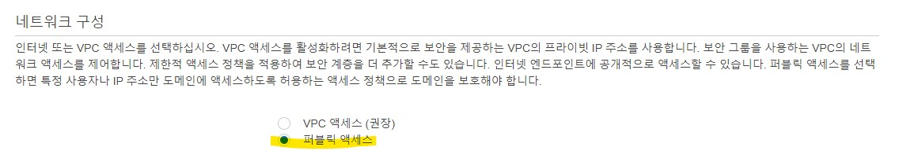

## ElasticSearch

ElasticSearch(이하 엘라스틱서치)는 '검색 엔진'입니다.
하지만 엘라스틱서치는 데이터를 입력받아 데이터를 빠르고 정확한 검색이 가능하도록 가공하고
이를 따로 저장하여 제공하는 기능 또한 제공하고 있습니다.

데이터를 저장한다는 점에서 데이터베이스와 무엇이 다른 지가 궁금하지 않을 수 없겠죠.
짧게 말하자면, 엘라스틱서치는 데이터베이스 용도로도 사용이 가능합니다.
하지만 데이터가 완벽한 실시간 처리가 되지 않는다는 점,
트랜잭션과 롤백이 불가능하다는 점,
업데이트가 업데이트가 아닌 삭제 후 새로운 데이터를 입력하는 식으로 이루어진다는 점 등에서 데이터의 안정성이 위협받을 수 있기에 사용은
가능하나 안정성 문제가 존재합니다.

자세한 사항은 엘라스틱 서치 공식 홈페이지 <ExternalLink href="https://www.elastic.co/kr/elasticsearch">Elastic</ExternalLink>과
김종민 님이 작성하신 <ExternalLink href="https://esbook.kimjmin.net">Elastic 가이드 북</ExternalLink>을 참고해 주세요.

## 프리 티어로 엘라스틱서치 구성하기

AWS는 t3.small 인스턴스 1개와 10GB의 저장 공간을 12개월간 무료로 제공합니다.


1개의 노드만 무료로 제공되기 때문에 개발 및 테스트 배포 유형으로 설정합니다.


t3.small 인스턴스를 선택하고 노드를 1개로 설정합니다.
EBS 스토리지도 10GB로 설정합니다.
N 개 이상으로 설정 시 요금이 N 배입니다.
즉 프리 티어의 시간이 N 배로 빠르게 흐르며 스토리지의 용량의 N 배 만큼 비용이 부과됩니다.

마스터 노드도 설정하지 않습니다. 설정 시 새로운 인스턴스가 할당되므로 마찬가지로 요금이 부과됩니다. 💸



무료로 사용하길 원하신다면 퍼블릭 액세스를 사용합니다.
VPC 액세스를 사용하기 위해선 VPC 서비스에 대한 비용이 발생합니다. 💸


AWS ElasticSearch Services는 엘라스틱서치 뿐만이 아닌 Kibana도 제공합니다.
Kibana는 데이터를 시각화해서 보여주고 콘솔 등을 사용하기 편하게 제공하는 플러그인입니다.

즉 대시보드 비슷한 서비스를 제공합니다. 따라서 계정을 설정하면 여러 사람이 각자 다른 권한으로 관리할 수 있습니다.
세분화된 액세스 제어 활성화를 체크하시면 각 다른 계정으로 Kibana에 로그인할 수 있습니다.


만약 기존에 AWS Cognito 서비스와 VPC 서비스를 사용하고 계시다면 IAM ARN으로 로그인할 수 있습니다만,
그렇지 않다면 마스터 사용자 생성 옵션으로 마스터 아이디로 로그인하시는 방법을 추천드립니다.

Kibana에 로그인할 아이디와 패스워드를 설정해 줍니다.


DynamoDB와 Lambda를 활용하여 데이터를 Sync할 예정이기 때문에 도메인에 대한 개방 액세스 허용을 사용합니다.

이후 진행해 주시면 완료 후 약 10분 뒤 엘라스틱서치 도메인이 생성됩니다.
도메인이 생성되면 엔드포인트 주소와 함께 Kibana 주소가 제공됩니다.

엔드포인트 주소로 데이터의 CRUD가 가능하며 이러한 데이터를 Kibana에서 확인하고 매핑 설정 등 자세한 설정이 가능합니다.

## 은전 한 닢 형태소 분석기 적용하기

데이터를 넣기 전에, 먼저 한글 형태소 분석기를 설정해 줍니다.
AWS ElasticSearch Services에는 '은전 한 닢'이라는 한글 형태소 분석기를 기본적으로 제공하고 있습니다만,
설정은 활성화되어 있지 않으므로 직접 활성화해 주어야 합니다.
이를 먼저 하는 이유는 데이터가 들어가며 자동으로 컬럼을 측정하고 생성하는 매핑 단계가 이루어지는데,
매핑된 이후에는 해당 형태소 분석 설정을 바꿀 수 없기 때문입니다. 😅

저는 포스트의 title 컬럼을 한글로 검색하도록 DB를 설계하였습니다.
따라서 매핑 설정의 title 속성에 한글 형태소 분석기를 사용하여 데이터를 색인하도록 설정하겠습니다.


우선 인덱스를 생성합니다. 인덱스는 테이블과 비슷한 개념입니다.
Kibana의 Consol 창에 아래의 명령어를 입력하여 생성합니다.

```json
PUT indexname //indexname에는 사용할 인덱스 이름을 적어주세요.
              //{ "acknowledged" : true }가 반환되었다면
              //성공적으로 명령이 수행된 것입니다.
```

이후 'seunjeon'명칭으로 은전 한 닢을 사용하는 분석기를 생성하며 title 속성에 적용시키겠습니다.

```json
PUT /indexname
{
  "settings": {
    "index":{
      "analysis": {
        "analyzer": {
          "seunjeon": {
            "type": "custom",
            "tokenizer": "seunjeon"
          }
        },
        "tokenizer" : {
          "seunjeon" : {
              "type" : "seunjeon_tokenizer"
          }
        }
      }
    }
  },
  "mappings": {
    "properties": {
      "title": {
        "type": "text",
        "analyzer": "seunjeon"
      }
    }
  }
}
```

인덱스에 한글 형태소 분석기 생성이 제대로 적용되었는지 확인해 보겠습니다.

GET indexname/\_analyze 명령으로 확인하실 수 있습니다.


## DynamoDB 데이터와 엘라스틱서치 연동하기

AWS의 서비스들은 Stream이라는 기능으로 데이터를 보낼 수 있습니다.
이를 활용해서 아래의 그림과 같이 데이터를 연동하겠습니다.


사용자에 의해 DynamoDB에 데이터가 CRUD 되면,
DynamoDB는 이를 수행 후 해당 이벤트를 Stream으로 Lambda에 보냅니다.
Lambda는 이벤트에 포함된 데이터로 엘라스틱서치에 해당 명령을 수행하도록 하는 함수를 실행합니다.

### DynamoDB Stream 설정하기

먼저, DynamoDB의 Stream을 활성화합니다. 새 이미지와 이전 이미지를 모두 보내도록 설정합니다.


### Lambda 함수 생성하기

Stream 데이터를 받아 이를 적절히 엘라스틱서치로 CRUD 해주는 Lambda 함수를 생성하겠습니다.
데이터를 쉽게 변환하기 위한 '@aws-sdk/util-dynamodb',
엘라스틱서치로 CRUD 하기 위한 '@elastic/elasticsearch' 라이브러리를 사용하겠습니다.
Lambda에서 라이브러리를 사용하는 방법은 <ExternalLink href="https://medium.com/signal9/aws-lambda-layer-%EC%82%AC%EC%9A%A9%ED%95%98%EA%B8%B0-node-js-8c299a1d0a6f">
AWS lambda layer 사용하기 (node.js)</ExternalLink>를 참고해 주세요. 😉

먼저, 데이터를 확인 후 CRUD 하는 함수들을 만들어 줍니다.

```js
//streamUtils.js

const { unmarshall } = require('@aws-sdk/util-dynamodb');

exports.insertData = insertData;
exports.updateData = updateData;
exports.deleteData = deleteData;

async function insertData(data, config, client) {
  const unmarshalledData = unmarshall(data.NewImage);
  const { index, primaryKey } = config;
  const id = unmarshalledData[primaryKey];

  await client.index({
    id,
    index,
    body: unmarshalledData,
  });
}

async function updateData(data, config, client) {
  const unmarshalledData = unmarshall(data.NewImage);
  const { index, primaryKey } = config;
  const id = unmarshalledData[primaryKey];

  await client.update({
    id,
    index,
    body: {
      doc: unmarshalledData,
    },
  });
}

async function deleteData(data, config, client) {
  const unmarshalledData = unmarshall(data.OldImage);
  const { index, primaryKey } = config;
  const id = unmarshalledData[primaryKey];

  await client.delete({
    id,
    index,
  });
}
```

이후 엘라스틱서치의 client 객체와 이벤트로 넘어온 데이터를 넘겨줍니다.

```js
//index.js

const { Client } = require('@elastic/elasticsearch');
const { insertData, updateData, deleteData } = require('./streamUtils');

const client = new Client({
  //엘라스틱서치의 엔드포인트를 설정해 줍니다.
  node: 'https://search-aaa-aaa.ap-northeast-2.es.amazonaws.com',
  auth: {
    //Kibana 마스터 계정을 설정해 줍니다.
    username: 'id',
    password: 'password',
  },
});
const config = {
  //index의 이름과 고윳값으로 설정한 컬럼명을 설정합니다.
  index: 'indexname',
  primaryKey: 'id',
};

exports.handler = async (event, context, callback) => {
  try {
    const records = event.Records;

    for (const record of records) {
      const eventName = record.eventName;
      const data = record.dynamodb;

      switch (eventName) {
        case 'INSERT':
          await insertData(data, config, client);
          break;
        case 'MODIFY':
          await updateData(data, config, client);
          break;
        case 'REMOVE':
          await deleteData(data, config, client);
          break;
      }
    }

    // return callback(null, console.log('done')); //콜백이 필요하다면 설정하세요.
  } catch (e) {
    console.error(e);
  }
};
```

### DynamoDB Stream과 Lambda를 트리거로 연결하기

다시 DynamoDB로 돌아와 Stream에서 트리거를 생성해 줍니다.
방금 전 만든 Lambda 함수와 연결해 주세요.
배치 사이즈는 본인의 서비스에 맞게 설정해 주세요.
저는 1로 설정하여 바로 전송되도록 했습니다.


### 잘 동작하는지 확인하기

DynamoDB에서 데이터를 생성해보세요.
로그를 CloudWatch에서 확인하고 엘라스틱서치에도 잘 들어갔는지 확인해보세요.


## 마치며

엘라스틱서치를 통해 아래와 같은 것들을 얻을 수 있었습니다.

- 형태소 분석과 함께, 빠른 속도의 검색 기능
- 특정 데이터를 보여주지 않는 기능
- DynamoDB의 읽기 유닛 사용량 감소
- DynamoDB에서 발생하던 중복 데이터 전달 버그 해소

하지만 ElasticSearch Services는 12개월만 프리 티어로 제공되는 제품이기에 그 이후에는 과금이 기다리고 있습니다.
아마도 프리 티어가 끝난다면 AWS Market을 통한 Elastic Cloud를 구독하여 사용하게 될 것 같아요. 왜냐면 더 저렴하거든요. 😭

DB를 갈아엎었지만, 이전에 작성했었던 <ExternalLink href="https://jthcast.dev/posts/things-i-wish-i-knew-before-using-dynamodb">
DynamoDB를 사용하기 전에 알았으면 좋았을 것들</ExternalLink>에서 언급된 문제점들을 모두 해결하게 되어 기쁩니다.

TAKE MY MONEY! 💰
